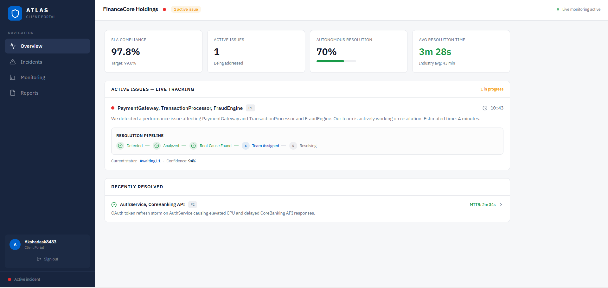

# ATLAS: AIOps for Managed Service Providers

> Detects failures before users notice. Finds root cause in seconds. Gets smarter with every incident.

🌐 [atlas-dhe.vercel.app](https://atlas-dhe.vercel.app) &nbsp;·&nbsp; 🔗 [Sign up](https://atlas-dhe.vercel.app/signup)

---

## What it does

Five flows drive everything:

```
DETECT -> CORRELATE -> DECIDE -> ACT -> LEARN
```

- Specialist agents monitor Java, PostgreSQL, Node.js, and Redis services continuously
- A 7-node LangGraph orchestrator correlates signals, queries Neo4j, searches ChromaDB, and calls an LLM
- A pure-Python confidence engine scores every decision and checks 8 hard vetoes before acting
- Pre-approved playbooks execute with pre-validation, success monitoring, and auto-rollback
- Every outcome feeds back into the confidence engine and trust progression model

---

## Architecture

<p align="center">
  
</p>

---

## Backend Engine

<p align="center">
  
</p>

---

## How It Works

| Step | What happens |
|------|-------------|
| **Detect** | Four specialist agents run a two-layer ensemble — Chronos-Bolt (time-series) + SHAP Isolation Forest (point anomaly) — with statistically calibrated confidence bands on every score |
| **Correlate** | A 7-node LangGraph orchestrator queries Neo4j, ChromaDB, and ServiceNow CMDB to find root cause, including the exact deployment that triggered it |
| **Decide** | A confidence engine routes to auto-resolution or human review. Eight hard vetoes ensure high-risk actions always reach a human |
| **Act** | Named, versioned, pre-approved playbooks execute with a rollback path always ready. No ad-hoc commands. No LLM-generated scripts |
| **Learn** | Every resolved incident and every human correction recalibrates the confidence model. The system earns autonomy through evidence — it cannot grant itself privileges |

---

## User Interfaces

### SDM — Service Delivery Manager

<p align="center">
  
</p>

### L1 Engineer — Triage

<p align="center">
  
</p>

### L2 Engineer — Investigation

<p align="center">
  
</p>

### Client Portal

<p align="center">
  
</p>

---

## Landing Page

<p align="center">
  
</p>

---

## Features

**Pre-Emptive Detection**
Chronos-Bolt detects gradual degradation; SHAP Isolation Forest catches sudden spikes. Conformal prediction produces calibrated confidence bands, not claimed ones. Seasonal baselines eliminate false positives on predictable traffic peaks.

**Structural Root Cause Analysis**
Neo4j knowledge graph syncs from ServiceNow CMDB via webhook. Deployment correlation query runs in under 200ms. ChromaDB surfaces the closest historical incidents by cosine similarity.

**Governed Automation**
Eight hard vetoes cover: change freeze windows, PCI-DSS/SOX business hours, Class 3 actions, P1 severity, GDPR-sensitive data, repeat actions, cold-start, and stale graph — none are overridable. Class 3 actions (database, network, production data) never auto-execute at any trust level, permanently. Dual cryptographic token sign-off enforced for all compliance-flagged approvals.

**Evidence-Gated Trust**
ATLAS advances through five trust stages only by accumulating confirmed correct resolutions. Nothing inside the system can change its own trust level. Each stage requires explicit human sign-off.

**Permanent Institutional Knowledge**
Every resolution writes a new Neo4j node, ChromaDB embedding, and Decision History record. New clients warm-start from anonymised embedding centroids of existing clients on the same tech stack — zero cold-start, zero data leakage.

---

## Tech Stack

| Component | Technology |
|-----------|------------|
| Backend | FastAPI, Python 3.11, asyncio |
| Orchestration | LangGraph |
| LLM | Cerebras Qwen3-235B → Ollama local fallback |
| Detection | Chronos-Bolt, Isolation Forest, SHAP, Conformal Prediction |
| Knowledge Graph | Neo4j Aura |
| Vector Store | ChromaDB (namespaced per client) |
| ITSM | ServiceNow Developer API |
| Frontend | React 18 + Tailwind + Framer Motion |

---

## Prerequisites

- Python 3.11
- Node.js 18+
- Neo4j Aura Serverless account
- ServiceNow Developer instance — free at [developer.servicenow.com](https://developer.servicenow.com)
- Ollama (for local LLM fallback)

---

## Setup

```bash
git clone https://github.com/your-org/atlas.git && cd atlas
pip install -r requirements.txt

cp .env.example .env              # fill in all values

python scripts/seed_neo4j.py
python scripts/seed_chromadb.py
python scripts/validate_similarity.py    # must PASS before proceeding

uvicorn backend.main:app --reload --port 8000
cd ui && npm install && npm run dev

python data/fault_scripts/financecore_cascade.py   # trigger demo scenario
```

---

## Key Metrics

| Metric | Value |
|--------|-------|
| MTTR Benchmark | 43 minutes (Atlassian 2024) |
| FinanceCore Auto-Execute Threshold | 0.92 |
| RetailMax Auto-Execute Threshold | 0.82 |
| Demo Confidence Score | 0.84 |
| Historical Similarity Match | 0.91 |
| Detection Confidence | 94% |

---

## Repository Structure

```
Atlas/
├── backend/              # FastAPI application, all Python logic
│   ├── agents/           # Specialist detection agents and detection models
│   ├── config/           # Client YAML configs and registry
│   ├── database/         # Neo4j, ChromaDB, and SQLite clients
│   ├── execution/        # Playbook library and approval tokens
│   ├── ingestion/        # Normaliser, CMDB enricher, event queue, adapters
│   ├── learning/         # Decision history, recalibration, weight correction, trust
│   ├── llm/              # LLM reasoning server (Cerebras + Ollama)
│   └── orchestrator/     # LangGraph pipeline, 7 nodes, confidence engine
├── data/
│   ├── fallbacks/        # Pre-computed LLM responses for demo reliability
│   ├── fault_scripts/    # Deterministic fault simulators for demo
│   └── seed/             # Cypher and JSON seed data for Neo4j and ChromaDB
├── docs/                 # Architecture, plan, use cases, master spec
├── Images/               # Platform screenshots and diagrams
├── ui/                   # React 18 dashboard
└── scripts/              # Setup, validation, and demo utility scripts
```

---

## Built with ❤️ by

[Anup Patil](https://github.com/anupp29) · [Khetesh Deore](https://github.com/khetesh-deore) · [Akshada Kale](https://github.com/Akshada-Kale)

---

## License

MIT — see [LICENSE](LICENSE) for details.