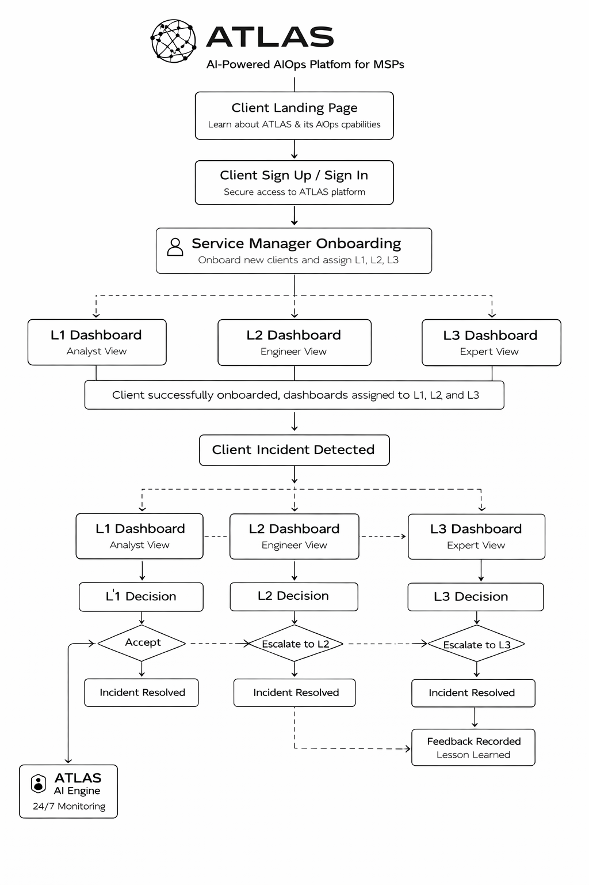

# ATLAS: AIOps for Managed Service Providers

> Detects failures before users notice. Finds root cause in seconds. Gets smarter with every incident.

🌐 [atlas-dhe.vercel.app](https://atlas-dhe.vercel.app) &nbsp;·&nbsp; 🔗 [Sign up](https://atlas-dhe.vercel.app/signup)

---

## Introduction

ATLAS is a multi-agent AIOps platform built for managed service providers.

It reads from ServiceNow CMDB, detects failures before users notice, and reasons over a live knowledge graph to find root cause in seconds. It manages the L1 → L2 → L3 service chain with governed automation and gets permanently smarter from every human decision made inside it.

Every existing AIOps product is built for one client's environment. ATLAS is built for the company managing hundreds of clients simultaneously  each with different stacks, different compliance regimes, different trust levels  from one platform.

---

## Dashboard Preview


---

## System Architecture



---

## Multi-Agent Detection System


---

## How It Works

| Step | What happens |
|------|-------------|
| **Detect** | Four specialist agents run a two-layer ensemble  Chronos-Bolt (time-series) + SHAP Isolation Forest (point anomaly)  with statistically calibrated confidence bands on every score |
| **Correlate** | A 7-node LangGraph orchestrator queries Neo4j, ChromaDB, and ServiceNow CMDB to find root cause, including the exact deployment that triggered it |
| **Decide** | A confidence engine routes to auto-resolution or human review. Seven hard vetoes ensure high-risk actions always reach a human |
| **Act** | Named, versioned, pre-approved playbooks execute with a rollback path always ready. No ad-hoc commands. No LLM-generated scripts |
| **Learn** | Every resolved incident and every human correction recalibrates the confidence model. The system earns autonomy through evidence  it cannot grant itself privileges |

---

## Repository Structure

```
atlas/
├── backend/            # FastAPI app — routes, WebSockets, agents, orchestrator, execution, learning
│   ├── config/         # Per-client YAML configs and registry
│   ├── ingestion/      # Normaliser, CMDB enricher, event queue, log adapters
│   ├── agents/         # Specialist agents (Java, PostgreSQL, Node.js, Redis) + correlation engine
│   ├── orchestrator/   # 7-node LangGraph pipeline + confidence scoring engine
│   ├── execution/      # Playbook library + cryptographic approval tokens
│   ├── learning/       # Decision history, recalibration, weight correction, trust progression
│   └── database/       # Neo4j, ChromaDB, and SQLite clients
├── frontend/           # React 18 dashboard
├── data/               # Neo4j seed scripts, ChromaDB embeddings, fault injection, LLM fallbacks
├── scripts/            # One-time setup: seed Neo4j, seed ChromaDB, validate similarity
├── .env.example
└── requirements.txt
```

---

## Features

**Pre-Emptive Detection**
Chronos-Bolt detects gradual degradation; SHAP Isolation Forest catches sudden spikes. Conformal prediction produces calibrated confidence bands, not claimed ones. Seasonal baselines eliminate false positives on predictable traffic peaks.

**Structural Root Cause Analysis**
Neo4j knowledge graph syncs from ServiceNow CMDB via webhook. Deployment correlation query runs in under 200ms. ChromaDB surfaces the closest historical incidents by cosine similarity.

**Governed Automation**
Seven hard vetoes cover: change freeze windows, PCI-DSS/SOX business hours, Class 3 actions, P1 severity, GDPR-sensitive data, repeat actions, and stale graph  none are overridable. Class 3 actions (database, network, production data) never auto-execute at any trust level, permanently. Dual cryptographic token sign-off enforced for all compliance-flagged approvals.

**Evidence-Gated Trust**
ATLAS advances through five trust stages only by accumulating confirmed correct resolutions. Nothing inside the system can change its own trust level. Each stage requires explicit human sign-off.

**Permanent Institutional Knowledge**
Every resolution writes a new Neo4j node, ChromaDB embedding, and Decision History record. New clients warm-start from anonymised embedding centroids of existing clients on the same tech stack  zero cold-start, zero data leakage.

---

## Prerequisites

- Python 3.11
- Node.js 18+
- Neo4j Aura Serverless account
- ServiceNow Developer instance — free at [developer.servicenow.com](https://developer.servicenow.com)

## Setup

```bash
git clone https://github.com/your-org/atlas.git && cd atlas
pip install -r requirements.txt

cp .env.example .env              # fill in all values

python scripts/seed_neo4j.py
python scripts/seed_chromadb.py
python scripts/validate_similarity.py    # must PASS before proceeding

uvicorn backend.main:app --reload --port 8000
cd frontend && npm install && npm run dev

python data/fault_scripts/financecore_cascade.py   # trigger demo scenario
```

---

## Built with ❤️ by

[Anup Patil](https://github.com/anupp29) · [Khetesh Deore](https://github.com/khetesh-deore) · [Akshada Kale](https://github.com/Akshada-Kale)

---

## License

MIT — see [LICENSE](LICENSE) for details.
