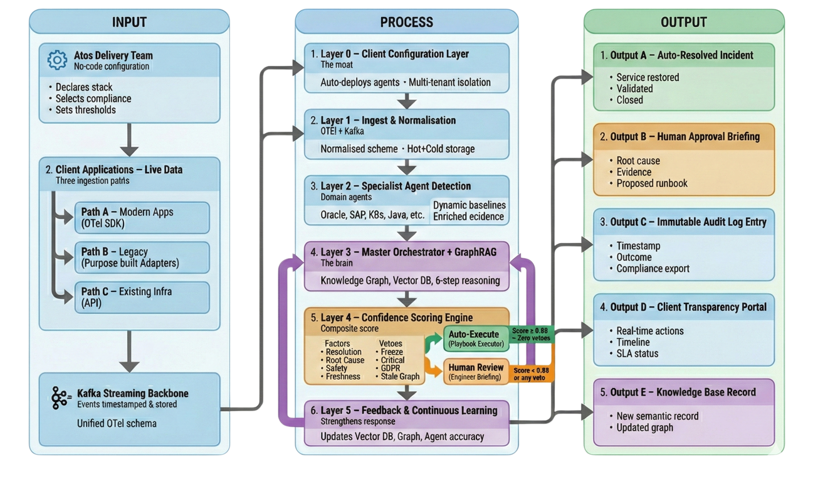

# Layer 4 — Confidence Scoring Engine

This is the gate every recommendation must pass through before anything is allowed
to run unattended. It is implemented in pure Python with **no LLM involvement** —
deterministic, auditable, and unit-testable in isolation
(`backend/orchestrator/confidence/scorer.py` and `vetoes.py`, called from
`orchestrator/nodes/n6_confidence.py`).



## Four Weighted Factors

The composite confidence score is a weighted sum of four independently-calculated
factors, each clamped to `[0.0, 1.0]`:

| Factor | Weight | Source | What it measures |
|---|---|---|---|
| **F1 — Historical Accuracy** | 30% | Decision History DB | Empirical success rate for this exact pattern / action / client triple. Returns a neutral `0.50` if fewer than 5 prior records exist (cold-start sentinel). |
| **F2 — Root Cause Certainty** | 25% | LLM hypothesis ranking | Normalised gap between the top and second-ranked hypothesis confidence. A gap ≥ 0.5 scores full certainty (1.0); a narrow gap signals genuine ambiguity. |
| **F3 — Action Safety Class** | 25% | Playbook library | Class 1 → `1.0`, Class 2 → `0.6`, Class 3 → `0.0`. |
| **F4 — Evidence Freshness** | 20% | Evidence timestamp | Linear decay from `1.0` at 0 minutes old to `0.0` at 20 minutes old. |

```python
# backend/orchestrator/confidence/scorer.py
composite = (f1 * 0.30) + (f2 * 0.25) + (f3 * 0.25) + (f4 * 0.20)
```

### Action Safety Classes

| Class | Examples | Auto-execute eligible? |
|---|---|---|
| **Class 1** | Service restart, cache clear, connection-pool / config parameter tuning | Yes — if threshold met and zero vetoes |
| **Class 2** | Service redeployment, infrastructure scaling | No — always routed to a human |
| **Class 3** | Database operations, network changes, production data | **Never** — a permanent architectural ceiling, not a configurable setting |

---

## The 8 Hard Vetoes

Every veto is checked independently, every time, regardless of how high the
composite score is. **Any single veto firing forces human review.** This is the
mechanism that keeps ATLAS from ever "talking itself into" an unsafe autonomous
action.

| # | Veto | Fires when |
|---|---|---|
| 1 | **Change freeze window** | Current time falls inside a configured freeze window (absolute date range or recurring daily window). |
| 2 | **Business-hours compliance** | Client is PCI-DSS or SOX flagged **and** the action is being considered during business hours — dual sign-off is mandated. |
| 3 | **Class 3 action** | The recommended action is Class 3. Fires unconditionally; this check runs first and short-circuits the rest of the scoring. |
| 4 | **P1 severity** | The incident is classified P1. Automated execution is never permitted for P1, regardless of score. |
| 5 | **Compliance-sensitive data** | Any affected service is flagged `compliance_sensitive` under an active GDPR or PCI-DSS framework. |
| 6 | **Duplicate action** | The same action was already attempted on the same service within the last 2 hours — repetition suggests a deeper unresolved issue. |
| 7 | **Stale knowledge graph** | The Neo4j graph has not been successfully read in over 24 hours, or was never updated — structural reasoning can't be trusted. |
| 8 | **Cold start** | Fewer than 5 historical records exist for this pattern. The decision is captured as seed data rather than acted on blind. |

!!! danger "Class 3 is a permanent ceiling"
    Veto 3 (`check_action_class_three`) is checked **before** any other
    calculation runs. If it fires, the composite score is set to `0.0`, every
    other veto is still evaluated for a complete audit record, and routing is
    forced to `L2_L3_ESCALATION` immediately. No client configuration can
    override this.

Every veto returns a plain-English, display-ready explanation string — never a
bare error code — so the engineer reviewing the briefing card sees exactly *why*
the system declined to act autonomously.

---

## Routing Logic

```python
# backend/orchestrator/nodes/n6_confidence.py
if composite >= auto_execute_threshold and not has_vetoes and action_class == 1:
    return "AUTO_EXECUTE"

if (composite >= 0.75
        and top_similarity >= 0.75
        and action_class == 1
        and not has_vetoes):
    return "L1_HUMAN_REVIEW"

return "L2_L3_ESCALATION"
```

| Routing path | Conditions |
|---|---|
| **`AUTO_EXECUTE`** | Composite score ≥ client's `auto_execute_threshold` **and** zero vetoes fired **and** action is Class 1. |
| **`L1_HUMAN_REVIEW`** | Composite ≥ 0.75 **and** top semantic-match similarity ≥ 0.75 **and** Class 1 **and** zero vetoes — a known pattern, but not confident enough to act alone. |
| **`L2_L3_ESCALATION`** | Everything else: novel patterns, Class 2/3 actions, P1 incidents, or any active veto. |

`auto_execute_threshold` is set **per client** in their configuration file and
must fall between 0.5 and 1.0:

| Client | Compliance posture | `auto_execute_threshold` |
|---|---|---|
| FinanceCore | PCI-DSS, SOX | `0.92` — stricter, regulated environment |
| RetailMax | Standard | `0.82` — more permissive, lower-risk environment |

This is why the same underlying confidence math can produce different routing
outcomes for two different clients on an otherwise identical incident — the bar
for autonomy is a client-governed setting, not a global constant.

[:octicons-arrow-right-24: Continue to Layer 5 — Execution Engine](execution-engine.md){ .md-button .md-button--primary }
