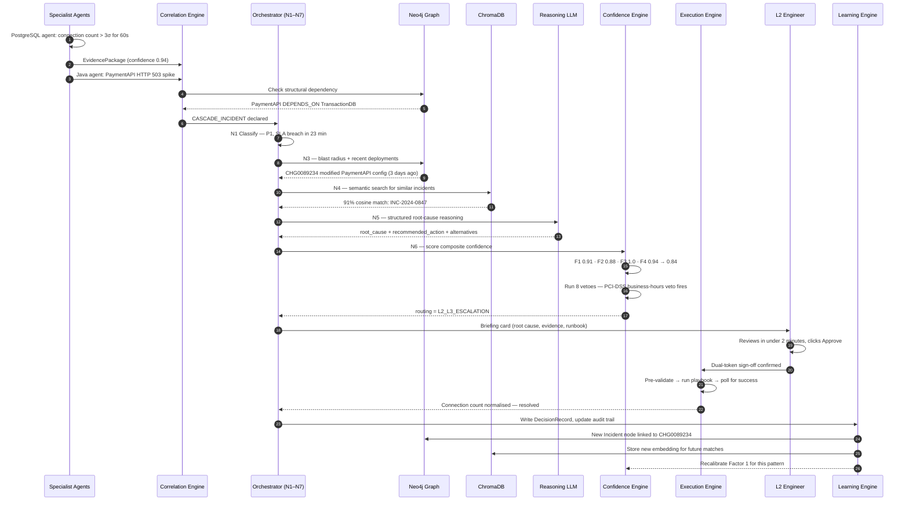

# End-to-End Data Flow

This page traces a single incident from raw telemetry to closed ticket, mapped onto
ATLAS's **Input → Process → Output** model.

## Input → Process → Output


=== "Input"

    | Source | Description |
    |---|---|
    | **MSP Delivery Team** | No-code configuration: declares the technology stack, selects applicable compliance frameworks, and sets thresholds for a client (Layer 0). |
    | **Client applications — live data** | Three ingestion paths run concurrently: Path A (modern apps via OTel SDK), Path B (legacy systems via purpose-built adapters), Path C (existing infrastructure via API pull). |
    | **Kafka streaming backbone** | All events are timestamped, normalised to a unified OTel schema, and stored in hot + cold tiers for both live correlation and historical replay. |

=== "Process"

    | Stage | Description |
    |---|---|
    | **Layer 0 — Client Configuration** | The thin, CMDB-native config layer: auto-deploys agents, enforces multi-tenant isolation. |
    | **Layer 1 — Ingest & Normalisation** | OTel + Kafka. Normalised schema, hot and cold storage. |
    | **Layer 2 — Specialist Agent Detection** | Domain agents (Java, PostgreSQL, Node.js, Redis) with dynamic seasonal baselines, producing enriched evidence packages. |
    | **Layer 3 — Master Orchestrator + GraphRAG** | The reasoning core: knowledge graph traversal, vector similarity search, and 6-step structured reasoning. |
    | **Layer 4 — Confidence Scoring Engine** | Composite score from 4 weighted factors, checked against 8 hard vetoes. Routes to **Auto-Execute** or **Human Review**. |
    | **Layer 5 / 6 — Feedback & Continuous Learning** | Every outcome updates the vector store, the knowledge graph, and per-agent accuracy statistics. |

=== "Output"

    | Output | Description |
    |---|---|
    | **A — Auto-Resolved Incident** | Service restored, validated, and closed without human intervention. |
    | **B — Human Approval Briefing** | Root cause, evidence, and a proposed runbook delivered to L1/L2/L3. |
    | **C — Immutable Audit Log Entry** | Timestamp, outcome, and a compliance-ready export. |
    | **D — Client Transparency Portal** | Real-time view of actions taken, timeline, and SLA status. |
    | **E — Knowledge Base Record** | A new semantic record and an updated knowledge graph, feeding the next incident. |

---

## Sequence: A Real Incident, End to End

The walkthrough below is a representative trace — a PostgreSQL connection-pool
exhaustion cascading into a payment API outage at a PCI-DSS-regulated client —
showing exactly which component acts at each step.



**Result in this trace:** total time from first signal to resolution was
**4 minutes 12 seconds**, against an industry median of **43 minutes** for
comparable P2 enterprise incidents — a **90% reduction**, with full audit
traceability at every step.

---

## Core Data Contracts

These three structures carry an incident through the entire pipeline. They are
deliberately minimal and strongly typed so that every node downstream can trust the
shape of the data it receives.

=== "EvidencePackage"

    Produced by every specialist agent the moment an anomaly is detected. Validated
    before it leaves the agent — incomplete evidence never enters the pipeline.

    ```python
    @dataclass
    class EvidencePackage:
        evidence_id: str              # uuid4
        agent_id: str                 # e.g. "java-agent"
        client_id: str                # mandatory, enforced
        service_name: str
        anomaly_type: str             # from the ATLAS error taxonomy
        detection_confidence: float   # 0.0–1.0, conformal-calibrated
        shap_feature_values: dict     # feature -> contribution_pct (sums to 100)
        conformal_interval: dict      # {lower, upper, confidence_level}
        baseline_mean: float
        baseline_stddev: float
        current_value: float
        deviation_sigma: float
        supporting_log_samples: list  # exactly 5 real log lines
        preliminary_hypothesis: str
        severity_classification: str  # "P1" | "P2" | "P3"
        detection_timestamp: datetime
    ```

=== "AtlasState"

    The LangGraph state object threaded through all seven orchestrator nodes. It
    enforces three classes of write discipline (see `state.py`):

    | Discipline | Fields | Rule |
    |---|---|---|
    | **Immutable after set** | `client_id`, `incident_id`, `evidence_packages`, `mttr_start_time` | Set once at pipeline entry; any later write raises a `StateGuardViolation`. |
    | **Append-only** | `audit_trail` | Only mutated through `append_audit_entry()`; never overwritten. |
    | **Once-set** | `routing_decision` | May be set once by Node 6; cannot be changed by any later node. |

    This is enforced in code, not by convention — `guard_routing_decision()` raises
    on violation, so a bug elsewhere in the pipeline cannot silently overwrite a
    routing decision after the fact.

=== "DecisionRecord"

    Written by the Learning Engine after every incident reaches a terminal state.
    Immutable after write — this is the ledger the confidence engine learns from.

    ```python
    @dataclass
    class DecisionRecord:
        record_id: str
        client_id: str
        incident_id: str
        anomaly_type: str
        service_class: str
        recommended_action_id: str
        confidence_score_at_decision: float
        routing_tier: str             # "L1" | "L2" | "L3" | "auto"
        human_action: str             # "approved" | "modified" | "rejected" | "escalated"
        modification_diff: dict | None
        rejection_reason: str | None
        resolution_outcome: str       # "success" | "failure" | "partial"
        actual_mttr: int              # seconds
        recurrence_within_48h: bool
        timestamp: datetime
    ```

---

## Where to Go Next

- [Detection Engine — how evidence is produced](detection-engine.md)
- [Orchestrator — how the seven nodes reason about evidence](orchestrator.md)
- [Confidence Engine — how routing decisions are made](confidence-engine.md)
- [Escalation chain — what happens after a human-review routing](../escalation/human-workflow.md)
