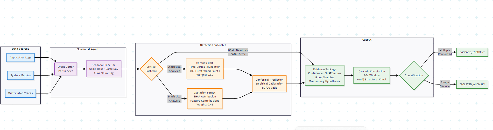

# Layer 2 — Specialist Agent Detection

Four domain-specialist agents continuously analyse live telemetry and produce a
single, strongly-typed output: the `EvidencePackage`. No agent ever calls an LLM —
detection is deterministic, fast, and fully explainable.



## The Four Agents

Each agent is a stateless Python class implementing three methods:
`ingest(event)`, `analyze()`, `get_evidence()` — defined once in `base_agent.py`
and specialised per technology.

| Agent | Module | Monitors | Critical Patterns |
|---|---|---|---|
| Java / Spring Boot | `agents/java_agent.py` | Error rate, P95 response time, JVM heap | HikariCP exhaustion, OOM, StackOverflowError |
| PostgreSQL | `agents/postgres_agent.py` | Connection count, query latency, lock waits | `FATAL: connection slots reserved`, deadlock detected |
| Node.js | `agents/nodejs_agent.py` | Unhandled-rejection rate, request latency | Promise rejection spikes, 5xx rate |
| Redis | `agents/redis_agent.py` | Memory usage, eviction rate, rejected commands | OOM, `maxmemory` threshold breach |

## Two-Layer Detection Ensemble

Detection combines two independent models so that gradual degradation and sudden
spikes are both reliably caught, and every output is explainable rather than a
black-box score.

=== "Layer A — Chronos-Bolt"

    **Time-series foundation model**, weight **0.55** in the ensemble.

    - Pretrained on 100 billion real-world time-series data points — no
      client-specific training required.
    - Fine-tuned on just 30 minutes of normal baseline per service.
    - Catches gradual degradation and temporal pattern violations that a static
      threshold would miss.

=== "Layer B — SHAP-Explained Isolation Forest"

    **Point-anomaly detection**, weight **0.45** in the ensemble.

    - Isolation Forest detects sudden spikes.
    - Every flag is wrapped by a SHAP `TreeExplainer` feature-importance
      breakdown, e.g. `error_rate: 67%, response_time: 21%, connection_count: 12%`.
    - Nothing is a black box — every detection states *why*.

=== "Conformal Prediction"

    Both model outputs are combined through **conformal prediction intervals**.
    Every anomaly score carries a statistically valid confidence band — *"94%
    confident this is anomalous"* is calibrated against held-out data, not an
    arbitrary claim.

    ```python
    # backend/agents/detection/conformal.py
    _CHRONOS_WEIGHT = 0.55
    _IF_WEIGHT = 0.45
    ```

## Seasonal Baselines

Every comparison is against a **same-hour, same-day-of-week rolling 4-week
average** — Monday 9 a.m. is compared to the last four Monday 9 a.m. windows, not
to a flat static threshold. This single design choice eliminates the most common
source of false positives in monitoring systems: predictable, recurring traffic
peaks.

## Three Detection Tiers

| Tier | Threshold | Action |
|---|---|---|
| **Warning** | 2σ deviation | Elevated monitoring only — no evidence package produced |
| **Alert** | 3σ sustained for 60 seconds | Triggers a full `EvidencePackage` |
| **Critical** | Known-bad error code (e.g. `FATAL`, `OOM`, `Deadlock`) | Immediate flag — no waiting period |

## Cascade Correlation Engine

A single anomalous agent is an `ISOLATED_ANOMALY`. ATLAS only escalates to a
`CASCADE_INCIDENT` when **two or more agents fire for services that are
structurally connected** — confirmed against the Neo4j knowledge graph's
`DEPENDS_ON` relationship, not merely because they happened close together in
time.

- **Correlation window:** 90 seconds, scoped per client.
- **Deployment correlation:** recent CMDB change records are checked at
  correlation time; if a recent change touches any service in the cascade chain,
  the incident is flagged as deployment-correlated immediately — before the
  orchestrator even runs.

## Proactive Early Warning

While the orchestrator is processing the current incident, Chronos-Bolt
continuously runs inference on every service adjacent to the blast radius.
Services trending between **1.5σ and 2.5σ** — below alert threshold, but moving
the wrong direction — surface as **Early Warning** cards on the engineer's
dashboard. ATLAS surfaces the next incident before it exists.

## EvidencePackage Output

Every detection — regardless of which agent or tier produced it — emits the same
typed structure, defined in full on the
[data flow page](data-flow.md#core-data-contracts). This uniformity is what lets
the orchestrator in Layer 3 reason about evidence from any technology without
agent-specific branching logic.

[:octicons-arrow-right-24: Continue to Layer 3 — Orchestrator & GraphRAG](orchestrator.md){ .md-button .md-button--primary }
