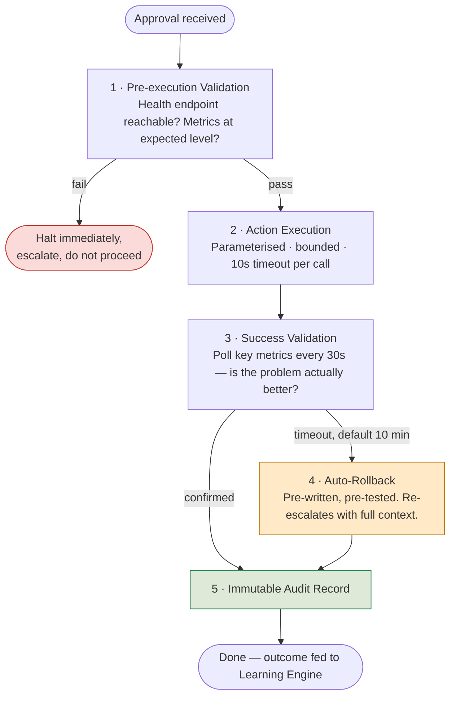

# Layer 5 — Execution Engine

Every action ATLAS takes is a **named, versioned, pre-approved playbook**. The
playbook library — `backend/execution/playbook_library.py` — is the absolute
boundary of autonomous action. There is no path from an LLM output to a shell
command; recommendations select *which registered playbook* to run, never *what
command to run*.

!!! danger "No ad-hoc commands. No LLM-generated scripts. Ever."
    This is enforced structurally: `_register()` raises at module load time if a
    Class 3 playbook is ever marked auto-execute eligible. The constraint cannot
    be bypassed by configuration.

## The Playbook Library (MVP)

| Playbook ID | Resolves | Class | Est. resolution |
|---|---|---|---|
| `connection-pool-recovery-v2` | `CONNECTION_POOL_EXHAUSTED` on Java/Spring Boot services via HikariCP | 1 | 5 minutes |
| `redis-memory-policy-rollback-v1` | Redis `maxmemory-policy` misconfiguration / OOM | 1 | — |

Each playbook is paired with its own rollback playbook (e.g.
`connection-pool-recovery-v2-rollback`), itself a fully registered, independently
validated playbook — rollback is never an afterthought bolted onto the forward
action.

## Five Mandatory Execution Steps

Every playbook run — automated or human-approved — passes through the same five
stages, with no shortcuts:

| Step | What ATLAS checks | Failure behaviour |
|---|---|---|
| **1. Pre-execution validation** | Is the target environment still in the expected state? Health endpoint reachable? Metric still above threshold? | Halts immediately and escalates — never proceeds on stale assumptions. |
| **2. Action execution** | Parameterised, bounded calls only (e.g. `POST /actuator/env`, `POST /actuator/refresh`). Every HTTP call carries a 10-second timeout and is logged with response code and latency. | — |
| **3. Success validation** | Key metrics polled every 30 seconds. Success means *the problem measurably improved* — not merely "the command returned 200." Default timeout: 10 minutes. | Falls through to rollback. |
| **4. Auto-rollback** | The paired rollback playbook fires automatically, with its own success validation, and re-escalates with full context. | — |
| **5. Immutable audit record** | Written unconditionally — success, failure, or rollback — with every action, metric, and timestamp captured. | — |

## Severity-Tiered Approval

| Priority | Approval required | Notes |
|---|---|---|
| **P3** | None — auto-execute | Only when the confidence score and zero-veto conditions are met. |
| **P2** | One-click approval (dashboard or Slack) | Single approver. |
| **P1** | **Dual cryptographic sign-off** | Two independent approvers, both timestamps and both signatures logged — see `backend/execution/approval_tokens.py`. |

## SLA Breach Interrupt

A background timer starts the moment Node 1 classifies the incident, independent
of whatever else is happening in the pipeline:

| Trigger | Behaviour |
|---|---|
| **Breach − 10 min** | Forced escalation to the next tier — no human needs to remember to escalate. |
| **Breach − 5 min** | Service Delivery Manager notification fires. |
| **Breach − 0** | Breach event logged; a compliance report is generated automatically. |

## MTTR Benchmark

Resolution time is measured against the **Atlassian 2024 State of Incident
Management Report**, which puts median MTTR for P2 enterprise IT incidents at
**43 minutes** — a third-party-published figure used consistently as the
comparison baseline throughout this documentation and the product itself.

[:octicons-arrow-right-24: Continue to Layer 6 — Learning Engine](learning-engine.md){ .md-button .md-button--primary }
