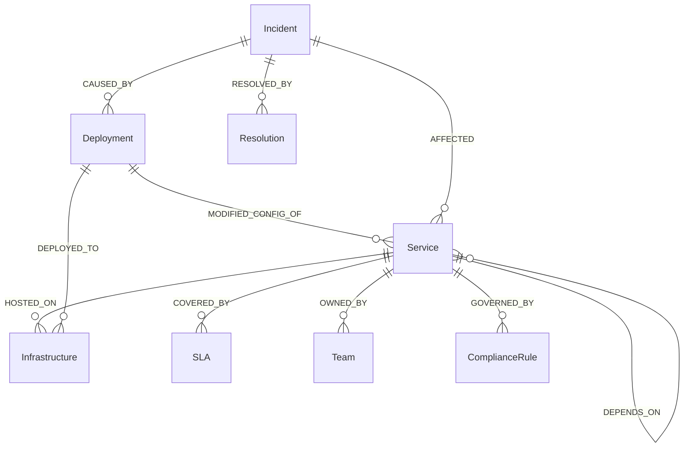

# Neo4j Knowledge Graph Schema

The knowledge graph is what lets ATLAS reason about *structure* — which services
depend on which, which deployment touched which service, which SLA covers which
team — rather than relying on text similarity alone. It is kept fresh by the
push-based CMDB webhook described in
[Layer 0](overview.md#layer-0-client-configuration-layer).

## Node Types

| Node | Key properties |
|---|---|
| `Service` | `name`, `client_id`, `tech_type`, `version`, `criticality`, `namespace` |
| `Infrastructure` | `name`, `client_id`, `type`, `provider`, `region` |
| `Deployment` | `change_id`, `client_id`, `deployed_by`, `change_description`, `timestamp`, `cab_approved_by`, `risk_rating` |
| `Incident` | `incident_id`, `client_id`, `title`, `occurred_at`, `root_cause`, `resolution`, `mttr_minutes`, `resolved_by`, `playbook_used` |
| `Problem` | `problem_id`, `client_id`, `title`, `root_cause`, `permanent_fix` |
| `SLA` | `service_name`, `client_id`, `breach_threshold_minutes`, `tier` |
| `Team` | `name`, `client_id`, `tier`, `contact` |
| `ComplianceRule` | `framework`, `client_id`, `rule_description`, `enforcement` |

## Relationship Types

| Relationship | Direction | Used by |
|---|---|---|
| `DEPENDS_ON` | `Service → Service`, weighted by criticality | Blast-radius traversal (Node 3, Query 1) |
| `HOSTED_ON` | `Service → Infrastructure` | Infrastructure impact analysis |
| `MODIFIED_CONFIG_OF` | `Deployment → Service` | Deployment correlation (Node 3, Query 2) |
| `DEPLOYED_TO` | `Deployment → Infrastructure` | Deployment correlation |
| `AFFECTED` | `Incident → Service` | Historical pattern matching (Node 3, Query 3) |
| `CAUSED_BY` | `Incident → Deployment` | Root-cause attribution |
| `RESOLVED_BY` | `Incident → Resolution` | Knowledge base lookups |
| `COVERED_BY` | `Service → SLA` | SLA breach countdown |
| `OWNED_BY` | `Service → Team` | Escalation routing |
| `GOVERNED_BY` | `Service → ComplianceRule` | Veto 5 — compliance-sensitive data check |

## Multi-Tenant Isolation

Every node carries a `client_id` property, and **every Cypher query issued by the
orchestrator filters on it explicitly** — there is no "global" query path that
could accidentally traverse across tenants. Combined with namespaced storage in
ChromaDB, this means a configuration error cannot leak one client's topology or
incident history into another client's view, by construction rather than by
convention.

## How the Three Read Queries Use This Schema

See [Orchestrator → Node 3](orchestrator.md#node-3-graph-intelligence) for the
exact Cypher run against this schema for blast-radius calculation, deployment
correlation, and historical pattern matching — all three run in parallel and are
cached for 60 seconds per client to keep latency low under repeated incident
bursts.
