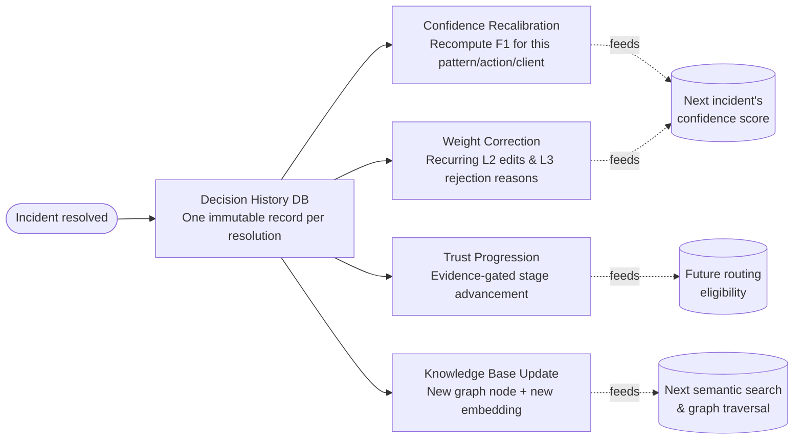
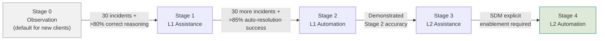

# Layer 6 — Continuous Learning Engine

ATLAS is designed to get measurably better at every client it serves, every single
day, without retraining a model from scratch. This layer closes the loop: every
resolved incident — automated or human-handled — feeds back into the confidence
engine, the knowledge graph, and the vector store.

## Decision History Database

One immutable record is written per incident resolution — this is the
`DecisionRecord` introduced on the [data flow page](data-flow.md#core-data-contracts).
A field worth calling out specifically:

!!! warning "`recurrence_within_48h` — catching symptomatic fixes"
    If the same incident pattern recurs on the same service within 48 hours, the
    original resolution is recorded as a **negative outcome even if its
    immediate metrics recovered**. A fix that made the dashboard look green for
    a day but didn't address the root cause should not be allowed to inflate
    Factor 1's historical accuracy.

## Confidence Recalibration

After every confirmed resolution, the empirical accuracy rate for that exact
pattern / action / client triple is recalculated from **all** matching Decision
History records and flows straight back into **Factor 1** of the confidence
score. The very next incident of the same shape gets a more accurate score —
there is no batch retraining step or deployment delay.

## Weight Correction

Two distinct correction signals are mined from human behaviour:

| Signal | Mechanism |
|---|---|
| **L2 modifications** | If the same parameter is adjusted in the same direction 3+ times on the same client, ATLAS updates the *default* for that action on that client. |
| **L3 rejections** | Rejection reason text is parsed; the rejected hypothesis type is weighted down and any substituted hypothesis is weighted up for future reasoning on similar incidents. |

## Trust Progression

Autonomy is **earned through evidence**, gated by non-negotiable thresholds — the
system cannot grant itself a higher trust stage, and an SDM must explicitly
confirm certain transitions.

| Stage | Name | Advancement requirement |
|---|---|---|
| **0** | Observation | Default starting point for every new client. |
| **1** | L1 Assistance | 30 incidents **and** > 80% confirmed-correct reasoning. |
| **2** | L1 Automation | 30 *additional* incidents **and** > 85% auto-resolution success rate. |
| **3** | L2 Assistance | Demonstrated Stage 2 accuracy sustained over time. |
| **4** | L2 Automation | Requires explicit SDM (Service Delivery Manager) enablement — never automatic. |
| **—** | Class 3 ceiling | Never auto-executes, at any stage. Permanent and non-configurable. |

A client can only advance **one stage at a time** — `trust_progression.py` raises
if a caller attempts to skip a stage — and the current trust level is exposed via
a read-only API endpoint so clients can surface it in their own dashboards.

## Knowledge Base Update

After every resolution, regardless of outcome:

- A new `Incident` node is created in Neo4j with full resolution detail, linked
  to the triggering deployment if one was found.
- A new embedding is stored in ChromaDB for future semantic matching.
- A **Problem record draft** is generated automatically if recurrence risk is
  assessed as high.
- A **Change request draft** is generated if the durable fix requires an
  infrastructure change beyond what the playbook performed.

This is what makes the system's knowledge an asset of the *client relationship*,
not a private model checkpoint — see
[Use Cases → Knowledge Ownership](../use-cases/index.md) for
how this is surfaced to clients.

[:octicons-arrow-right-24: See the Neo4j graph schema this layer writes to](graph-schema.md){ .md-button .md-button--primary }
