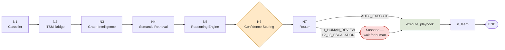
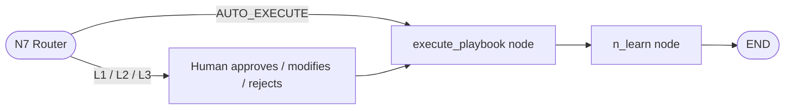

# Layer 3 — Master Orchestrator & GraphRAG

The orchestrator is the reasoning core of ATLAS: a **7-node LangGraph state
machine** that takes raw evidence packages and produces a root cause, a
recommended action, and a routing decision — with full state persistence across
however long human review takes.



!!! note "Why LangGraph"
    State persists for the **entire incident lifecycle**, including across a
    human-review suspension that might last minutes or hours. Nothing is lost
    between steps — the graph resumes exactly where it left off once a human
    responds. This is implemented in `backend/orchestrator/pipeline.py`, built on
    `StateGraph(AtlasState)`.

## The AtlasState Object

A single typed dictionary threads through every node, accumulating fields as the
incident progresses:

```text
client_id, incident_id, evidence_packages        # set at entry, immutable
correlation_type                                 # CASCADE_INCIDENT | ISOLATED_ANOMALY
blast_radius, recent_deployments,
historical_graph_matches, graph_traversal_path    # ← Node 3
semantic_matches                                  # ← Node 4
root_cause, recommended_action_id,
alternative_hypotheses                            # ← Node 5
composite_confidence_score, active_veto_conditions,
factor_scores                                     # ← Node 6
routing_decision                                  # ← Node 7, once-set
servicenow_ticket_id                              # ← Node 2
execution_status, execution_result                # ← Execution Engine
audit_trail                                       # append-only throughout
mttr_start_time, mttr_seconds                     # immutable start, filled on close
```

See [Data Flow → AtlasState](data-flow.md#core-data-contracts) for the full write
discipline enforced on this object.

---

## Node Reference

### Node 1 — Incident Classifier
Assigns ITIL priority **P1–P4** based on service criticality, cascade scope, and
SLA breach imminence, and starts the SLA breach countdown. A P1 with breach
imminent in under 15 minutes triggers immediate L2/L3 notification regardless of
what the confidence engine later decides.

### Node 2 — ITSM Bridge
Calls the real ServiceNow REST API and creates an actual `INC` ticket — priority,
assignment group, affected CI, caller, and short description populated from
state. The ticket number is written back to state and every subsequent action in
the incident updates that same ticket.

### Node 3 — Graph Intelligence
Three Cypher queries run in parallel against Neo4j, cached for 60 seconds per
client. This is the step that grounds ATLAS's reasoning in actual infrastructure
topology rather than text similarity alone.

=== "Query 1 — Blast Radius"

    ```cypher
    MATCH (s:Service {name: $service_name, client_id: $client_id})
    MATCH (s)-[:DEPENDS_ON*1..3]-(connected:Service)
    OPTIONAL MATCH (connected)-[:COVERED_BY]->(sla:SLA)
    RETURN connected.name, connected.criticality, sla.breach_threshold_minutes
    ```

=== "Query 2 — Deployment Correlation"

    ```cypher
    MATCH (d:Deployment {client_id: $client_id})
    WHERE d.timestamp > datetime() - duration('P7D')
    MATCH (d)-[:MODIFIED_CONFIG_OF|DEPLOYED_TO]->(s:Service)
    WHERE s.name IN $affected_services
    RETURN d.change_id, d.change_description, d.deployed_by,
           d.timestamp, d.cab_risk_rating
    ORDER BY d.timestamp DESC
    ```

=== "Query 3 — Historical Pattern"

    ```cypher
    MATCH (i:Incident {client_id: $client_id})-[:AFFECTED]->(s:Service)
    WHERE s.name IN $affected_services
      AND i.anomaly_type = $anomaly_type
    RETURN i.incident_id, i.root_cause, i.resolution,
           i.mttr_minutes, i.resolution_playbook, i.resolved_by
    ORDER BY i.timestamp DESC LIMIT 5
    ```

The full ordered traversal path — every node and edge visited — is stored in
state and rendered in the frontend graph visualisation as proof of *structural*
reasoning, not keyword matching.

### Node 4 — Semantic Retrieval
A ChromaDB vector-similarity search against the client's own incident
collection. New clients are warm-started using federated embedding centroids
from existing clients on the same technology stack, so semantic search is useful
from day one rather than requiring months of accumulated history. The top 3
matches are returned with cosine similarity scores. If a match also appears in
the Node 3 graph results, it is treated as **double-confirmed** and given maximum
weight in the reasoning context passed to Node 5.

### Node 5 — Reasoning Engine
Calls the LLM with a structured, six-step ITIL-style reasoning prompt:

1. Symptom characterisation
2. Impact assessment
3. Change correlation
4. Historical match validation
5. Hypothesis ranking
6. Resolution recommendation

The LLM returns strict, schema-validated JSON — a malformed response is
structurally impossible to act on:

```json
{
  "root_cause": "string",
  "confidence_factors": {},
  "recommended_action_id": "string",
  "alternative_hypotheses": [
    {
      "hypothesis": "string",
      "evidence_for": "string",
      "evidence_against": "string",
      "confidence": 0.0
    }
  ],
  "explanation_for_engineer": "string",
  "technical_evidence_summary": "string"
}
```

**Primary / fallback model strategy:** a fast hosted Cerebras model
(`qwen-3-235b-a22b-instruct-2507` by default) serves the common path; a
locally-run Ollama model takes over automatically if the primary is
unreachable, so root-cause reasoning degrades gracefully rather than failing
the incident entirely. See `backend/llm/cerebras_server.py`.

### Node 6 — Confidence Scoring Engine
Pure Python — zero LLM involvement, fully deterministic. Covered in depth on the
[Confidence Engine page](confidence-engine.md).

### Node 7 — Router
Writes the final `routing_decision` to state — `AUTO_EXECUTE`,
`L1_HUMAN_REVIEW`, or `L2_L3_ESCALATION` — exactly once. If the decision
requires a human, LangGraph **suspends** the graph at this point; state persists
indefinitely and the system resumes with zero degradation whenever the human
responds, whether that takes two minutes or two hours.

---

## After Routing



Both paths converge on the same `execute_playbook` node and the same `n_learn`
node — automated and human-approved resolutions are executed, audited, and
learned from identically. See
[Execution Engine](execution-engine.md) and
[Learning Engine](learning-engine.md).
