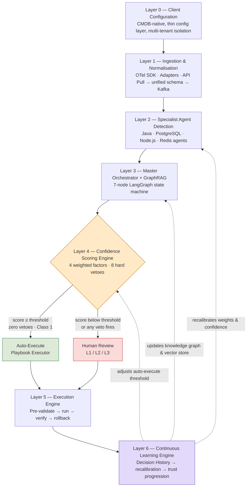

# System Architecture — Overview

ATLAS is organised into **seven layers**, numbered 0 through 6, plus a learning loop
that feeds back into the layers above it. Configuration sits at Layer 0; continuous
learning sits at Layer 6 and writes back into Layers 2, 3, and 4.



For the input → process → output view of the same system, see
**[End-to-End Data Flow](data-flow.md)**.

---

## Layer 0 — Client Configuration Layer

**Role:** the moat. This is what makes onboarding a new client fast and what keeps
every tenant's data, thresholds, and compliance rules isolated.

ATLAS does not duplicate a CMDB. Layer 0 reads service topology, CI relationships,
change records, and business criticality directly from the client's ServiceNow CMDB
via **push-based Change Webhooks** — not polling — so the knowledge graph is never
more than seconds stale.

The thin ATLAS-side configuration layer holds only what the CMDB cannot provide:

| Setting | Purpose |
|---|---|
| `auto_execute_threshold` | Composite confidence score required before ATLAS acts autonomously (per client) |
| `max_action_class` | Highest action safety class eligible for automation |
| `compliance_frameworks` | PCI-DSS, SOX, GDPR behavioural constraints |
| `escalation_matrix` | Who is notified at L1 / L2 / L3 and through which channel |
| `sla_breach_thresholds` | Time-to-breach per service criticality tier |
| `change_freeze_windows` | Absolute or recurring periods where no automation is permitted |

!!! info "Multi-tenant isolation is architectural, not policy"
    Every client's events, embeddings, and graph nodes are namespaced at the
    storage layer. A configuration mistake cannot leak one client's incident data
    into another client's dashboard, because the isolation boundary is enforced in
    the data model, not just in application logic.

Onboarding a new client is: point ATLAS at the CMDB webhook → fill in the thin
config → done. There is no bespoke integration work per client.

---

## Layer 1 — Ingestion & Normalisation

Three ingestion paths feed the same unified OpenTelemetry (OTel) schema, so the rest
of the pipeline never needs to know which path an event arrived through:

=== "Path A — Modern Apps"

    Applications instrumented with the **OpenTelemetry SDK** push traces, metrics,
    and logs natively. This is the preferred path for any service the client
    controls the codebase of.

=== "Path B — Legacy Systems"

    **Purpose-built adapters** translate proprietary or legacy log/metric formats
    (e.g. on-prem Java app servers, mainframe-adjacent systems) into the same
    unified schema without requiring code changes on the client side.

=== "Path C — Existing Infrastructure"

    For clients with an existing monitoring stack, ATLAS **pulls via API** from
    that stack rather than re-instrumenting everything from zero.

All three paths converge on:

1. **Normalisation** — every event is mapped into the unified OTel schema (`normaliser.py`).
2. **CMDB enrichment** — each event is tagged with service criticality, owning team,
   and compliance sensitivity from the Layer 0 graph (`cmdb_enricher.py`).
3. **Kafka streaming backbone** — normalised, enriched events are timestamped and
   queued (`event_queue.py`), with hot storage for active correlation and cold
   storage for historical replay and learning.

---

## The Seven Layers at a Glance

| # | Layer | Responsibility | Primary Module(s) |
|---|---|---|---|
| 0 | Client Configuration | CMDB-native, thin per-tenant config | `backend/config/` |
| 1 | Ingestion & Normalisation | Unify three ingestion paths into one schema | `backend/ingestion/` |
| 2 | Specialist Agent Detection | Domain-aware anomaly detection ensemble | `backend/agents/` |
| 3 | Master Orchestrator + GraphRAG | 7-node reasoning state machine | `backend/orchestrator/` |
| 4 | Confidence Scoring Engine | Composite score + 8 hard vetoes → routing | `backend/orchestrator/confidence/` |
| 5 | Execution Engine | Validated, reversible playbook execution | `backend/execution/` |
| 6 | Continuous Learning Engine | Recalibration, trust progression, KB updates | `backend/learning/` |

Continue to:

[:octicons-arrow-right-24: Detection Engine (Layer 2)](detection-engine.md){ .md-button }
[:octicons-arrow-right-24: Orchestrator (Layer 3)](orchestrator.md){ .md-button }
[:octicons-arrow-right-24: Confidence Engine (Layer 4)](confidence-engine.md){ .md-button }

---

## Complete Technology Stack

| Layer | Technology | Why |
|---|---|---|
| Backend API | FastAPI on Python 3.11+ | Native async, first-class WebSocket support |
| Orchestration | LangGraph | Durable state machine with native human-in-the-loop interrupts |
| LLM — primary | Cerebras (`qwen-3-235b-a22b-instruct-2507`) | High-throughput hosted inference for root-cause reasoning |
| LLM — fallback | Local Ollama (`qwen3-coder:480b-cloud`), with Anthropic/OpenAI as further fallbacks | Offline-capable, zero-cost degradation path |
| Time-series detection | Chronos-Bolt (HuggingFace) | Pretrained foundation model, no per-service cold start |
| Point-anomaly detection | Isolation Forest + SHAP | Explainable, production-proven |
| Uncertainty calibration | Conformal prediction | Statistically valid confidence bands, not just claimed ones |
| Knowledge graph | Neo4j | Real-time CMDB-synced structural reasoning |
| Vector store | ChromaDB (namespaced per client) | Historical-incident semantic search |
| CMDB sync | ServiceNow Change Webhook | Push-based, seconds-latency graph freshness |
| ITSM | ServiceNow | Ticket creation/lookup in real INC format |
| Approval | Cryptographic one-time tokens | Dual sign-off for compliance-flagged actions |
| Frontend | React 18 + TypeScript + Tailwind CSS | Typed, componentised, fast to iterate |
| Graph visualisation | Force-directed graph rendering | Interactive blast-radius and causal-path views |
| Audit store | SQLite (production-schema, migration-ready) | Simple, exportable, immutable-by-convention |
| Streaming backbone | Kafka-pattern event queue | Timestamped, replayable event log |

---

## Repository Layout at a Glance

```text
Atlas-main/
├── backend/            FastAPI service: agents, orchestrator, execution, learning
├── ui/                 React + TypeScript frontend (Vite)
├── data/               Seed data, fault-injection scripts, fallback responses
├── scripts/            Operational scripts: seeding, health checks, validation
├── IntegrationScripts/ Cross-system integration utilities
├── docs/               Source design documents (architecture, roadmap, use cases)
└── Images/             Product screenshots and architecture diagrams
```

See **[Codebase Reference → Backend](../codebase/backend-reference.md)** for the
complete, file-by-file breakdown.
