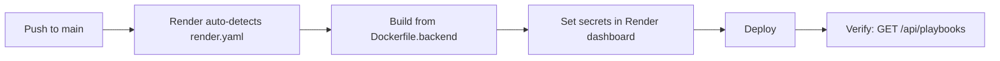

# Deployment Guide

## Short Answer

| Component | Recommended platform |
|---|---|
| **Frontend** (`ui/`) | Vercel — a static Vite build, well-suited to its model |
| **Backend** (`backend/`) | A persistent container platform (Render, Railway, Fly.io, ECS, AKS) — **not** Vercel serverless |

## Why Vercel Is Not a Fit for the Backend

`backend/main.py` is a long-running, stateful service, and serverless execution
fundamentally conflicts with three of its requirements:

1. **WebSocket endpoints** for continuous streams — `/ws/logs/{client_id}`,
   `/ws/incidents/{client_id}`, `/ws/activity`.
2. **Background monitoring loops** started at application startup and kept
   running for the lifetime of the process.
3. **In-memory active-incident and connection state** that must persist across
   requests, not be torn down between invocations.

The frontend has none of these constraints — it's a static build that talks to
the backend over HTTP/WebSocket — so the split is: **static frontend on Vercel,
stateful backend on a container platform.**

This repository ships the configuration for exactly that split:

| File | Purpose |
|---|---|
| `Dockerfile.backend` | Production container build for the backend |
| `render.yaml` | Render.com deployment manifest |
| `ui/vercel.json` | Vercel configuration for the frontend |

## Deploying the Backend on Render



1. Create a new **Render Web Service** from this repository — Render
   auto-detects `render.yaml`.
2. Set the required secrets in the Render dashboard:

    ```text
    NEO4J_URI
    NEO4J_USERNAME
    NEO4J_PASSWORD
    SERVICENOW_INSTANCE_URL
    SERVICENOW_USERNAME
    SERVICENOW_PASSWORD
    ATLAS_SECRET_KEY
    CEREBRAS_API_KEY
    ```

3. Optionally set LLM tuning variables:

    ```text
    CEREBRAS_MODEL=qwen-3-235b-a22b-instruct-2507
    OLLAMA_BASE_URL=...
    OLLAMA_MODEL=...
    ```

4. Once the frontend URL is known, lock CORS down to it:

    ```text
    ATLAS_FRONTEND_ORIGIN=https://your-ui-domain.vercel.app
    ```

5. Deploy, then verify the health path: `GET /api/playbooks` should return the
   registered playbook library.

## Deploying the Frontend on Vercel

1. Import the repository into Vercel.
2. Set **Root Directory** to `ui`.
3. Build command: `npm run build` · Output directory: `dist`.
4. Set frontend environment variables:

    ```text
    VITE_ATLAS_API_BASE_URL=https://your-backend-domain
    VITE_ATLAS_WS_BASE_URL=wss://your-backend-domain
    VITE_ATLAS_DEFAULT_CLIENT_ID=FINCORE_UK_001
    ```

5. Deploy.

## Post-Deploy Smoke Checks

Run from the repository root once both services are live:

```bash
python scripts/health_check.py \
  --backend-url https://your-backend-domain \
  --frontend-url https://your-ui-domain \
  --client-id FINCORE_UK_001
```

All **critical** checks should pass; optional checks may warn if non-essential
mock services are intentionally offline — that is expected, not a failure.

!!! warning "Known local-only limitation"
    `test_progress.py` at the repository root is an integration smoke check
    intended for local development. It flushes logs immediately for
    deterministic reads but may fail if local-only fixtures are absent —
    it is **not** intended as the sole production deployment gate. Use
    `scripts/health_check.py` for that purpose.

---

## This Documentation Site on GitHub Pages

This documentation itself is built with **MkDocs Material** and is ready to
publish via GitHub Pages with zero additional setup:

1. Commit this `mkdocs.yml`, `docs/`, `requirements.txt`, and
   `.github/workflows/deploy-docs.yml` to the repository.
2. In **GitHub → Settings → Pages**, set the source to **GitHub Actions**.
3. Push to `main` — the included workflow builds and deploys automatically on
   every change under `docs/` or `mkdocs.yml`.
4. To preview locally before pushing:

    ```bash
    pip install -r requirements.txt
    mkdocs serve
    # → http://127.0.0.1:8000
    ```

Update `site_url` and `repo_url` in `mkdocs.yml` to your actual GitHub Pages
URL and repository before publishing.
