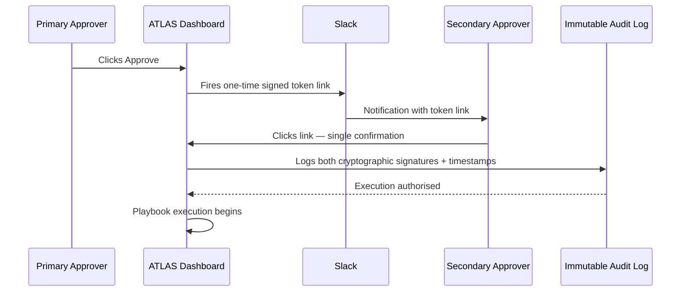

# The Human Escalation Chain — L1 → L2 → L3

ATLAS never acts without a human in the loop **unless every condition for
autonomous execution is met** (see [Confidence Engine](../architecture/confidence-engine.md)).
The escalation chain is the governance layer that takes over the moment any one
of those conditions fails.

## Three Tiers, Three Levels of Depth

Each tier sees more evidence than the one before it — and each tier's actions
carry more learning weight, because a correction from a deep technical architect
is a stronger signal than a triage approval.

=== "L1 — Service Desk Engineer"

    **Built for speed under pressure.** Time budget: under 2 minutes.

    What L1 sees, and nothing more:

    - A two-sentence incident summary
    - A numbered, step-by-step checklist
    - SLA countdown in large numbers
    - **Approve** → execute · **Escalate** → L2

    There is no investigation tooling on this screen by design — L1's job is
    fast triage on known patterns, not root-cause analysis.

=== "L2 — Technical Support Engineer"

    **Investigation grade.** A full six-section briefing card:

    | # | Section | Content |
    |---|---|---|
    | 1 | Situation Summary | Affected services, business impact, SLA time remaining |
    | 2 | Blast Radius | Interactive, animated dependency graph |
    | 3 | Deployment Correlation | The actual CMDB change record that caused this |
    | 4 | Historical Match | Real cosine similarity score, link to the full historical incident |
    | 5 | Alternative Hypotheses | Ranked, with evidence *for* and *against* each |
    | 6 | Recommended Action | Playbook details, risk class, rollback availability |

    Three actions, each with a distinct learning consequence:

    - **Approve** — executes exactly as recommended.
    - **Modify** — opens a parameter-editing panel; the diff is logged, and if
      the same modification direction recurs 3+ times for this client, ATLAS
      updates its default.
    - **Reject** — opens a mandatory free-text reason field. ATLAS immediately
      runs a semantic search over the playbook library using that reason text,
      surfacing alternative playbooks instantly. Both the rejection and the
      substituted action are recorded as learning signals.

    If the incident touches a PCI-DSS or SOX client, the
    [compliance gate](#compliance-gate-dual-cryptographic-approval) engages here.

=== "L3 — Deep Technical Architect"

    **Institutional knowledge.** Everything in L2, plus:

    - A cross-client, anonymised portfolio-pattern panel
    - A pre-populated Problem record draft, ready for one-click submission
    - A pre-populated Change Request draft, if a permanent fix requires an
      infrastructure change
    - A full confidence debug panel — every factor score, every veto check,
      the complete reasoning chain

    L3 actions are **Accept / Modify / Reject**, and L3 corrections carry
    **3× the learning weight** of an L2 correction — the resolution becomes
    permanent institutional knowledge, not a one-off fix.

## What Happens at Each Decision

| Decision | Effect |
|---|---|
| **Approve / Accept** | Playbook executes through the [five-step execution process](../architecture/execution-engine.md#five-mandatory-execution-steps). Outcome recorded, learning signal written. |
| **Modify** | Diff logged. Modified playbook executes. Repeated modification direction updates the per-client default after 3 occurrences. |
| **Reject** | Mandatory reason captured. Semantic search over the playbook library re-surfaces alternatives. Rejected hypothesis type weighted down for future similar incidents. |
| **Escalate** | Incident moves to the next tier with full context pre-populated; the escalating engineer's stated reason is logged alongside it. |

## Compliance Gate — Dual Cryptographic Approval

When a PCI-DSS or SOX veto fires (see
[Confidence Engine → Vetoes](../architecture/confidence-engine.md#the-8-hard-vetoes)),
production configuration changes require **dual sign-off**, implemented exactly
as real regulated change-management processes require:

Execution begins **only after both confirmations are logged** — there is no
single-click path to a production change on a regulated client, even for a
Class 1 action.

---

[:octicons-arrow-right-24: See the API endpoints behind Approve / Modify / Reject](../api/reference.md){ .md-button }
[:octicons-arrow-right-24: See the dashboards each tier actually uses](../interfaces/screenshots.md){ .md-button }
