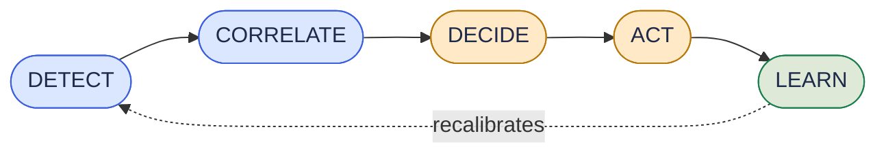

# ATLAS

### Autonomous AIOps for Managed Service Providers

**ATLAS detects failures before users notice them, finds root cause in seconds, and resolves
incidents autonomously — under continuous, auditable, human-governed control.**

<strong>70%</strong>Autonomous Resolution

<strong>3m 28s</strong>Average MTTR

<strong>94%</strong>Root Cause Accuracy

<strong>8</strong>Hard Safety Vetoes

!!! abstract "What this site is"
    This is the complete technical documentation for the **ATLAS** platform: system
    architecture, end-to-end data flow, every backend and frontend module documented
    file-by-file, the API surface, the human escalation model, and operational guides.
    It is generated from — and verified line-by-line against — the production codebase.

---

## What ATLAS Does

ATLAS is built around five continuously running flows. Every incident, from first
anomaly to closed ticket, moves through this loop:

| Flow | What happens |
|---|---|
| **Detect** | Specialist agents run a two-layer ensemble — a time-series foundation model plus a SHAP-explained Isolation Forest — with statistically calibrated confidence bands on every score. |
| **Correlate** | A 7-node LangGraph orchestrator queries a Neo4j knowledge graph, a ChromaDB vector store, and the ServiceNow CMDB to identify root cause, including the exact deployment that triggered it. |
| **Decide** | A pure-Python confidence engine combines four weighted factors and checks 8 hard, non-overridable vetoes before any action is allowed to run unattended. |
| **Act** | Named, versioned, pre-approved playbooks execute with pre-validation, success monitoring, and an automatic rollback path. No ad-hoc commands. No LLM-generated scripts ever touch production. |
| **Learn** | Every resolved incident — and every human correction — recalibrates the confidence model and the trust-progression ledger. The system earns autonomy through evidence; it cannot grant itself privileges. |

[:octicons-arrow-right-24: Read the full architecture](architecture/overview.md){ .md-button .md-button--primary }
[:octicons-arrow-right-24: See the end-to-end data flow](architecture/data-flow.md){ .md-button }

---

## Find Your Way Around

-   :material-sitemap-outline:{ .lg .middle } **Architecture**

    ---

    Seven layers, from client onboarding to continuous learning. State machines,
    schemas, and the reasoning behind every design decision.

    [:octicons-arrow-right-24: System overview](architecture/overview.md)

-   :material-source-branch:{ .lg .middle } **Codebase Reference**

    ---

    Every backend module and frontend component, file by file: what it does,
    what it consumes, what it produces, what guardrails it enforces.

    [:octicons-arrow-right-24: Backend reference](codebase/backend-reference.md)

-   :material-account-supervisor-outline:{ .lg .middle } **Human Workflow**

    ---

    How an incident moves from autonomous detection through L1 → L2 → L3
    escalation, with full compliance gating.

    [:octicons-arrow-right-24: Escalation chain](escalation/human-workflow.md)

-   :material-api:{ .lg .middle } **API Reference**

    ---

    Every REST endpoint and WebSocket channel the backend exposes, with
    request/response contracts.

    [:octicons-arrow-right-24: API reference](api/reference.md)

-   :material-monitor-dashboard:{ .lg .middle } **User Interfaces**

    ---

    Screenshots and walkthroughs of the SDM, L1, L2/L3, and client-facing
    portals, straight from the live product.

    [:octicons-arrow-right-24: View interfaces](interfaces/screenshots.md)

-   :material-rocket-launch-outline:{ .lg .middle } **Deployment & Operations**

    ---

    Local development setup, environment configuration, and the production
    deployment path.

    [:octicons-arrow-right-24: Deployment guide](deployment/guide.md)

---

## Design Principles

!!! tip "Autonomy is earned, not assumed"
    No incident auto-executes by default. A composite confidence score must clear a
    **per-client, configurable threshold** (0.92 for a PCI-DSS/SOX client by default,
    lower for less regulated clients) **and** trigger **zero** of the 8 hard vetoes
    **and** target a Class 1 (lowest-risk) action. Every other case is routed to a
    human, with full evidence attached.

!!! tip "Class 3 actions never auto-execute — permanently"
    Database operations, network changes, and anything touching production data are
    architecturally excluded from autonomous execution. This is not a configuration
    flag a client can raise; it is a ceiling enforced in code.

!!! tip "Every action is reversible and auditable"
    Every playbook ships with pre-validation, post-execution health checks, and a
    paired rollback playbook. Every decision — automated or human — is written to an
    immutable audit log with a full evidence trail.

---

*ATLAS is built by Atos as an AIOps platform for Managed Service Provider (MSP)
environments. This documentation reflects the current state of the codebase in this
repository.*
