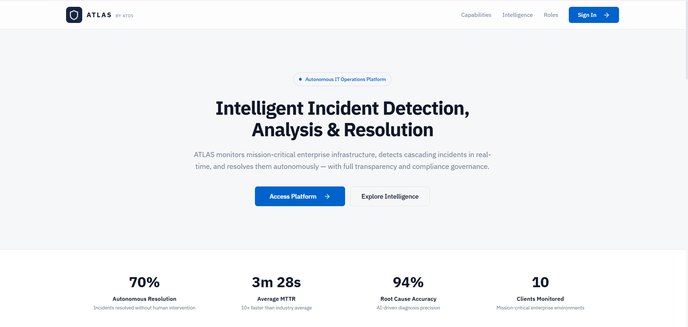
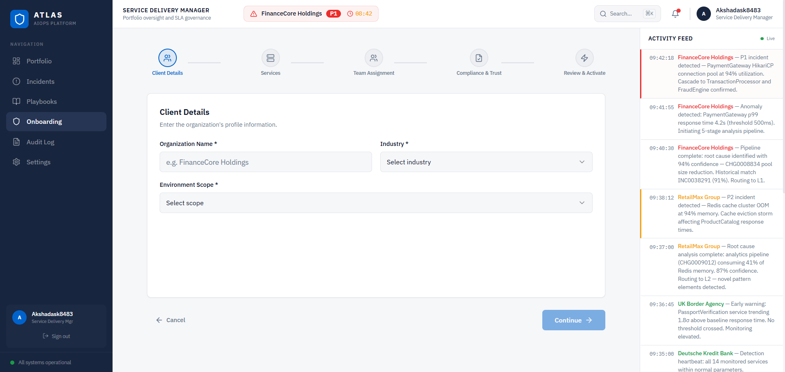
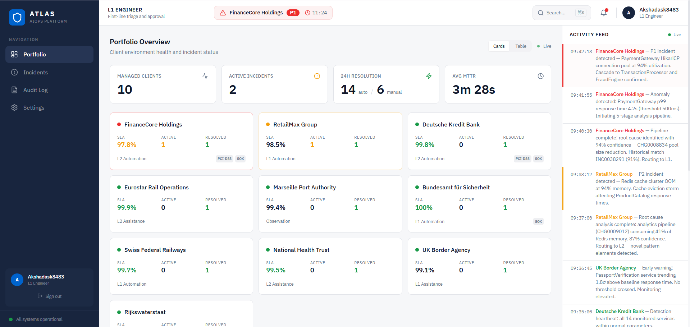
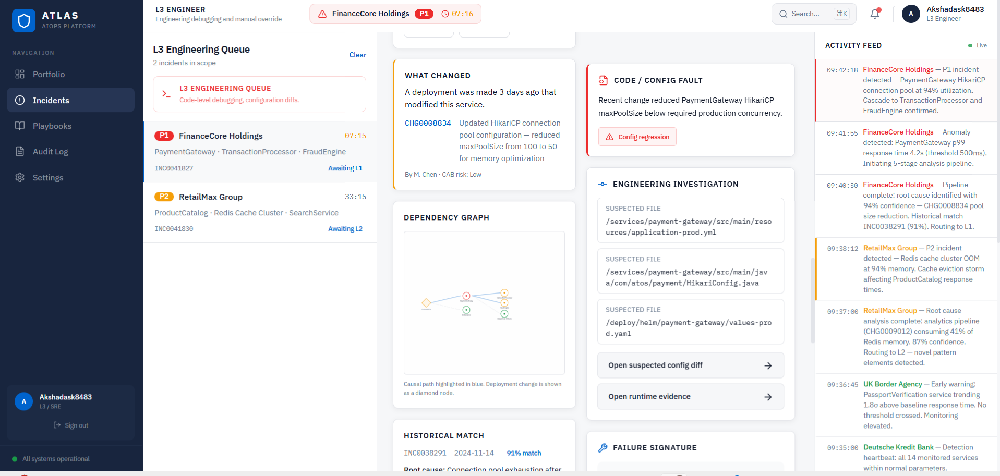

# User Interfaces

ATLAS ships role-specific views rather than one generic dashboard — each tier sees
exactly the depth of information appropriate to the decision it needs to make. The
screenshots below are taken directly from the running product.

## Landing Page

Public-facing entry point: capabilities, intelligence, and role overview, plus the
headline metrics that summarise platform performance across all managed clients.

<strong>70%</strong>Autonomous Resolution

<strong>3m 28s</strong>Average MTTR

<strong>94%</strong>Root Cause Accuracy

<strong>10</strong>Clients Monitored

---

## Service Delivery Manager — Portfolio Oversight

The SDM view is built for governance across an entire client portfolio: onboarding
new clients (the no-code [Layer 0 configuration](../architecture/overview.md#layer-0-client-configuration-layer)
wizard), SLA tracking, and a live, cross-client activity feed.

The onboarding flow walks through five steps — **Client Details → Services → Team
Assignment → Compliance & Trust → Review & Activate** — turning a new client
integration into a guided form rather than bespoke engineering work, exactly as
described in [Layer 0](../architecture/overview.md#layer-0-client-configuration-layer).

---

## L1 Engineer — Portfolio Triage

L1's home view is the **Portfolio Overview**: every managed client, active
incident counts, 24-hour resolution split between automated and manual, and
average MTTR — all in one glance, with a live activity feed of what ATLAS is doing
across the entire book of business right now.

Per the [escalation chain](../escalation/human-workflow.md),
when L1 opens an actual incident the view narrows to a two-sentence summary, a
numbered checklist, and **Approve** / **Escalate** — deliberately nothing more.

---

## L2 / L3 Engineer — Investigation Console

The deep investigation console: suspected file diffs, an interactive dependency
graph with the causal path highlighted, historical match percentage, and the exact
configuration change responsible — everything described in
[Node 3 — Graph Intelligence](../architecture/orchestrator.md#node-3-graph-intelligence)
made visible and actionable.

This is the surface where the **six-section briefing card** —
situation summary, blast radius, deployment correlation, historical match,
alternative hypotheses, and recommended action — comes together, alongside the
code/config fault detail and failure-signature panel unique to L2/L3 depth.

---

## Client Portal — Transparency Without Access

Clients never see internal engineering tooling — they see **Output D**, the
transparency portal: live SLA compliance, the autonomous resolution rate that
applies to *their* environment specifically, and a resolution pipeline that shows
exactly where their active issue stands, without exposing credentials, raw logs,
or internal playbook detail.

This is the realisation of [Output D](../architecture/data-flow.md)
from the data-flow model: real-time actions, timeline, and SLA status, scoped
strictly to the client's own incidents.

---

[:octicons-arrow-right-24: See the full escalation logic behind these screens](../escalation/human-workflow.md){ .md-button .md-button--primary }
